# Dokumentáció

### Önéletrajz bázis

Készítette: Pusztai Enikő / I42XKJ

## Követelményanalízis

### Célkitűzés, projektindító dokumentum

A program legfőbb célja az önéletrajzkezelő felület megvalósítása. Az adatok védelme érdekében legyen lehetőség regisztrációra, majd bejelentkezésre. Bejelentkezett felhasználó új önéltrajzot hozhat létre, módosíthatja, vagy törölheti azt. A felhasználónak lehetősége nyílik más szakemberek értékelésére is. Vendégként bárki megtekintheti az elkészült önéletrajzokat és azok értékeléseit is.

### Funkcionális követelmények:

+ Vendégként a főoldalon szeretném megtekinteni az önéletrajzok kategóriáit.
+ Vendégként szeretnék az önéletrajzok között szabadon böngészni.
+ Vendégként szeretnék egy önéletrajzot megtekinteni.
+ Vendégként szeretném egy önéletrajz értékelését megtekinteni.
+ Vendégként szeretnék tudni regisztrálni az oldalra.
+ Felhasználóként szeretnék tudni bejelentkezni az oldalra.
+ Felhasználóként szeretném tudni a profiladatomat szerkeszteni.
+ Felhasználóként szeretnék tudni új önéletrajzot feltölteni.
+ Felhasználóként szeretnék tudni szakembert értékelni.

### Nem funkcionális követelmények:
+ Felhasználóbarát, ergonomikus elrendezés és kinézet.
+ Gyors működés.
+ Biztonságos működés: jelszavak tárolása, funkciókhoz való hozzáférés.

### Szakterületi fogalomjegyzék

**Önéletrajz:** Személyes adatgyűjtemény egy munkavállaló eddigi tevénységéről

### Használatieset-modell, funkcionális követelmények

**Vendég:** Csak a publikus funkciókat ér el
+ Publikus oldalak megjelenítése
(önéletrajzok, kategóriák, konkrét önéletrajz, önéletrajz értékelésének megtekintése)

**Bejelentkezett felhasználó:** A publikus funkciókon kívül
+ Új kategória felvitele
+ Saját önéletrajz szerkesztése
+ Saját önéletrajz törlése
+ Szakemberek értékelése

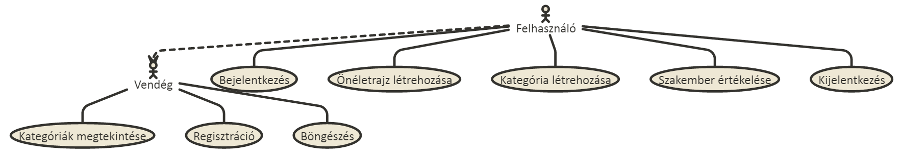

Vegyünk példának néhány egyszerű folyamatot:

**Bejelentkezés:**

+ A felhasználó az oldalra érkezve regisztrál
+ Regisztráció után a Belépés gombra kattint
+ Az adatainak kitöltése után a Submit gombra kattintva bejelentkezik

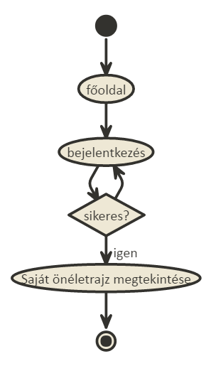

**Új önéletrajz létrehozásaa, megtekintése:**

+ A felhasználó bejeletkezik az oldalra
+ Az önéletrajz feltöltése gombra kattint
+ Az adatok kitöltése után a Submit gommbal elmenti az új önéletrajzot
+ Az önéletrajz böngészésre gombra kattint
+ A listából a megtekinteni kívánt önéletrajz sorában lévő megtekintés gombra kattint

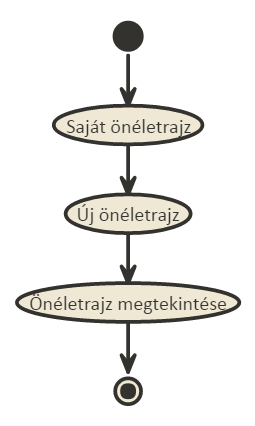

**Szakember értékelése:**

+ A felhasználó bejeletkezik az oldalra
+ Az önéletrajz böngészésre gombra kattint
+ A listából a megtekinteni kívánt önéletrajz sorában lévő megtekintés gombra kattint
+ Az értékel gombra kattint

A felhasználó a saját önéletrajzát nem értékelheti, csak másokét!

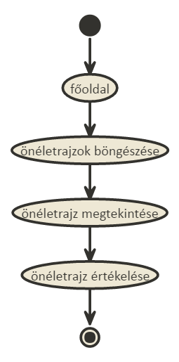

## Tervezés

### Architektúra terv

#### Komponensdiagram

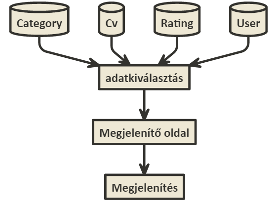

##### Oldaltérkép:

**Publikus:**

- Főoldal
- Önéletrajzok böngészése
    + Önéletrajz megtekintése
- Belépés
- Regisztráció

**Felhasználó**

- Kilépés
- Önéletrajzok böngészése
	+ Szakember értékelése
- Új kategória felvitele
- Új önéletrajz felvitele

#### Végpontok

- GET / : főoldal
- GET /cvs : önéletrajzok
- GET /cvs/create : új önéletrajz felvitele, űrlap megjelenítése
- POST /cvs/create : új önéletrajz felvitele, adatok küldése
- GET /cvs/:id :  önéletrajz megtekintése
- GET /cvs/:id/edit : önéletrajz szerkesztése, űrlap megjelenítése
- POST /cvs/:id/edit : önéletrajz szerkesztése, adatok küldése
- GET /cvs/:id/delete : önéletrajz törlése
- GET /cvs/:id/rate : önéletrajz értékelése, űrlap megjelenítése
- POST /cvs/:id/rate : önéletrajz értékelése, adatok küldése
- GET /category/create : kategória felvitele, űrlap megjelenítése
- POST /category/create : kategória felvitele, adatok küldése
- GET /register : regisztráció, űrlap megjelenítése
- POST /register : regisztráció, adato küldése
- GET /login : bejelentkező oldal, űrlap megtekintése
- POST /login : bejelentkező oldal, adatok küldése
- GET /logout : kijelentkező oldal

### Felhasználói-felület modell

#### Oldalvázlatok:

**Főoldal** 

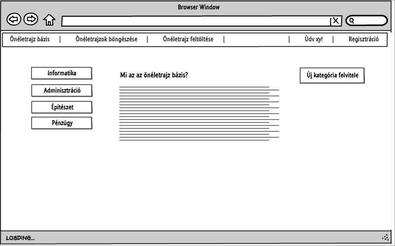

**Kategória felvitele** 

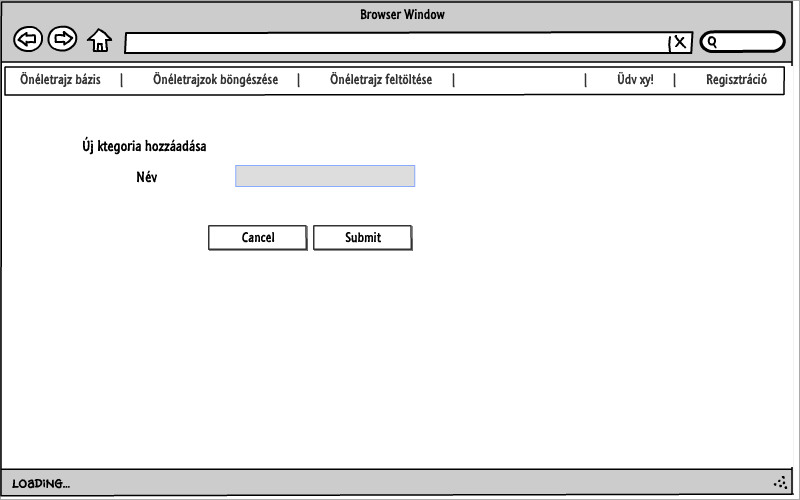

**Önéletrajz lista**

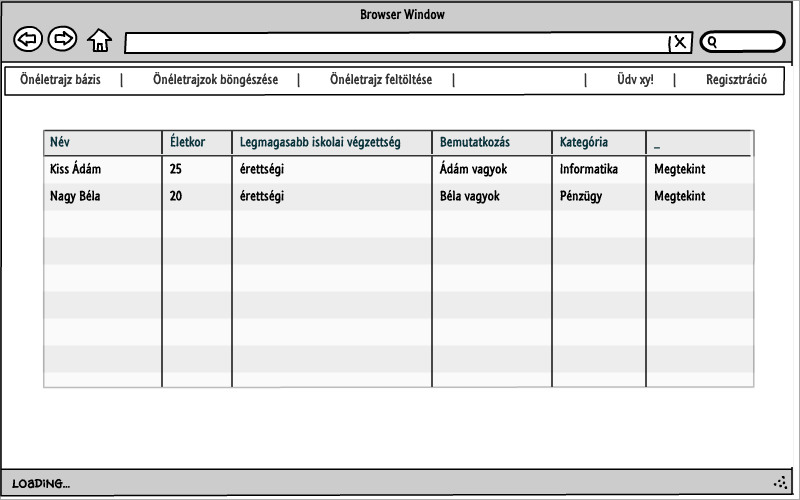

**Önéletrajz megtekintése**

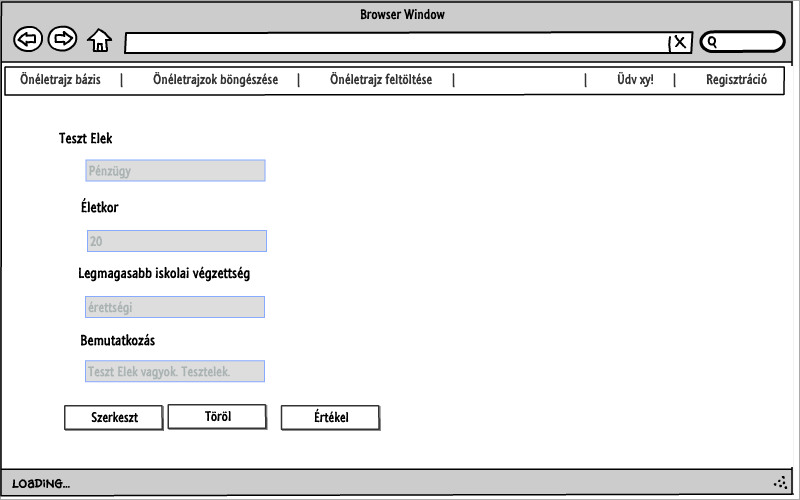

**Értékelés**

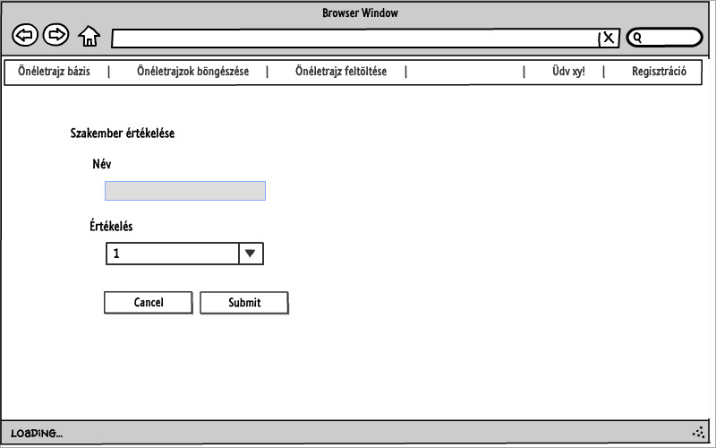

#### Designtervek (végső megvalósítás kinézete):

**Főoldal** 

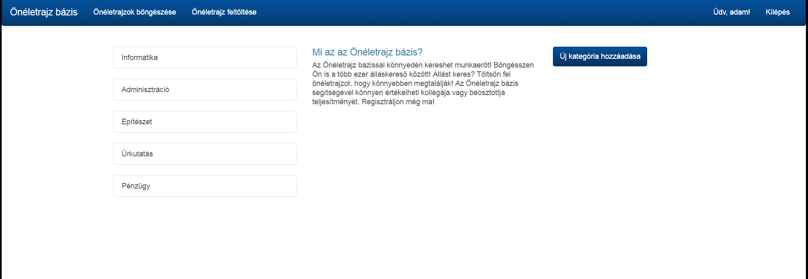

**Kategória felvitele** 

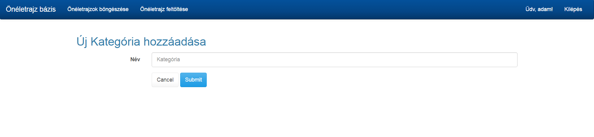

**Önéletrajz lista**

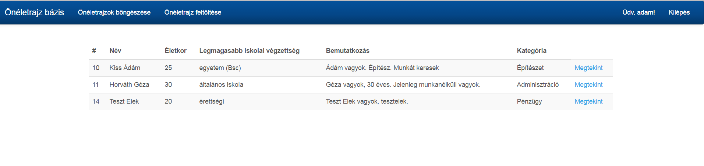

**Önéletrajz megtekintése**

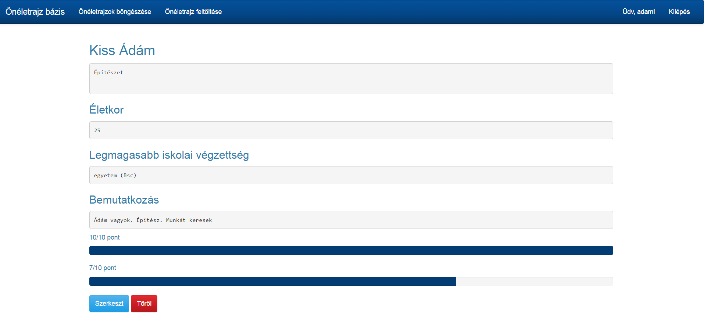

**Értékelés**

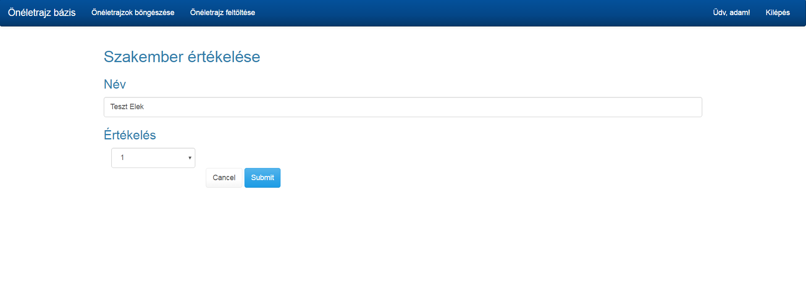

#### Osztálymodell

**Adatmodell**

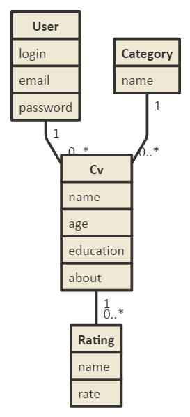

## Implementáció

#### Fejlesztőkörnyezet

Github account szükséges
Belépés után új workspace létrehozása (node.js)
Ezután elkezdhetjük a kód írását
git add paranccsal kiválaszthatunk egy fájlt verzionálásra, vagy git add . paranccsal az összes fájlt kiválaszthatjuk
git commit -m "commit" paranccsal feltehetjük a fájlokat. Az így megjelölt verziókhoz a későbbiekben visszatérhetünk, különbségüket megtekinthetjük.
git push origin master paranccsal a lokális tárolóból feltölthetjük a tartalmat a Github-ra.
Végezetül a Github oldalán leellenőrizhetjük a munkánkat.

#### Könyvtárstruktúra, funkciók

- cvs
  + app
    + Http
      + Controllers
        - CategoryController.js
        - CVController.js
        - UserController.js
      - routes.js
    + Model
      - Category.js
      - Cv.js
      - Rating.js
      - Token.js
      - User.js
  + resources
    - createCategory.njk
    - createCv.njk
    - editCv.njk
    - layout.njk
    - login.njk
    - main.njk
    - rateCv.njk
    - register.njk
    - showCv.njk
    - table.njk
    
## Felhasználói dokumentáció

Futtatáshoz szükséges operációs rendszer: Tetszőleges operációs rendszer

A futtatáshoz szükséges hardver: Operációs rendszerek szerint megadva

Egyéb követelmények: Internet böngésző telepítése, JavaScript ajánlott

Program használata:

Böngészőben nyissuk meg a főoldalt
Jobb felső sarokban kattintsunk a Bejelentkezés feliratra
Bejelentkezés/Regisztráció után a főoldalra jutunk
Az Új kategória felvitele gombra kattintva tudunk új kategóriákat felvenni a listába
Töltsük ki az űrlapot
Hibás adatok esetén az űrlap jelezni fogja a hibát
Submit gombra kattintva mentsük el az adatokat
Önéletrajzok böngészése oldal: Listában megtekinthetjük az önéletrajzokat
Lista oldalon: Megtekint gombra kattintva a megtekintés oldalra jutunk
Megtekintés oldalon található a szerkesztés gomb, értékelés és a törlés funkció
Szerkesztés oldal: megegyezik az új önéletrajz felvitel funkcióval, csak a megadott adatokat a felület megjeleníti

# A szerveroldali alkalmazás progresszív fejlesztése kliensoldali JavaScript segítségével
Érintett file-ok:
- cvs
  + app
    + Http
      + Controllers
        - CategoryController.js
        - CVController.js
        - UserController.js
      - routes.js
  +public
    +scripts
      - cvRate.js
      - cvTable.js
      - delete.js
      - popup_category.js
      - popup_login.js
  +resources
    +views
    - layout.njk
    - main.njk
    - showCv.njk
    - table.njk
    

